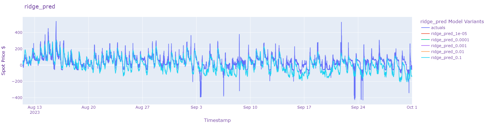
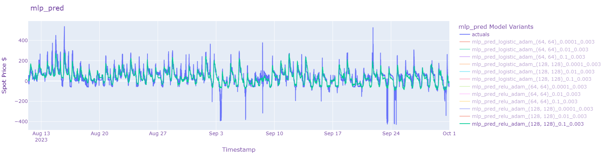

# Electricity-Price-Forecasting

Project to predict wholesale electricity spot price for Victoria, Australia.

Notebook and .py scripts are available however will only be shared upon request.

Using independant variables based on NEM Market data in addition to weather data both from publicly available sources I aim to predict the spot price
for wholesale electricity over 5 minute intervals. 

Here used are the following regression techniques aavailable from the Sk-Learn library:

- Linear Regression with Ridge Regularisation
- Gradient Boosted Regression
- Multi-Layer Perceptron Regressor

Roughly 1.5 years of most recent historic data is used with an 80/20 training/test split. Standardisation parameters are obtained over the training set and applied over the test set. Training set outliers are filtered out beyond 2 standard deviations to not train over the extreme price intervals. (Something to include and investigate later) 
 

ToDo:
- Include error metrics to have quantified overview over model performance (MAE,MSE,MAPE,R2 as well as for specific time periods eg. Hours of day) 
- Compare also for NSW, SA, QLD, TAS (each have significantly different generation portfolios to Victoria)
- Compare to AEMO pre-dispatch/forecast on prices and evaluate relative performance 
- Investigate different combinations of weather input stations used / interpolations of the weather data variables
- Perhaps include Pre-Dispatch as part of the prediction
- Compare performance with/without standardised data
- Investigate further Hyper-Parameter Optimisation methods
- Compare with different combination of independant variables / breakdown of model over different periods eg. Solar Periods where Solar Irradiance values > 0
  
Here is the training losses for several MLP regressor variants - useful for observing training progression and sensitivities to parameters and choose better hyperparameters.

 

Below are predictions over the test set for the 3 regression techniques and the variants.

